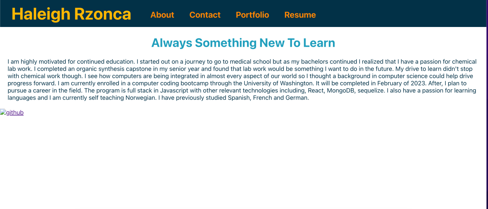
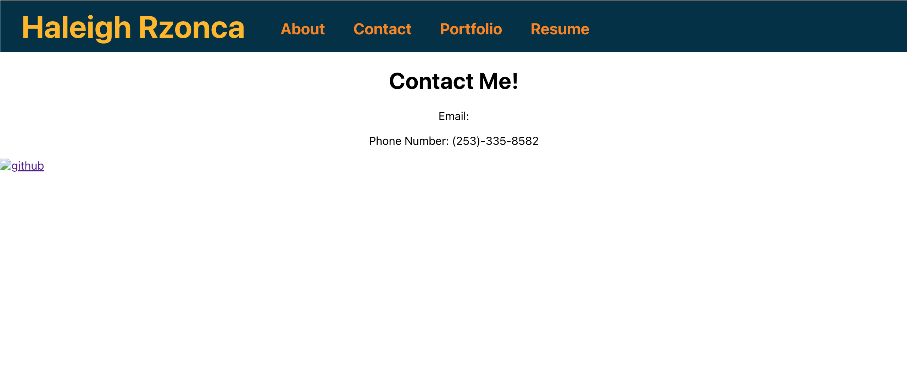
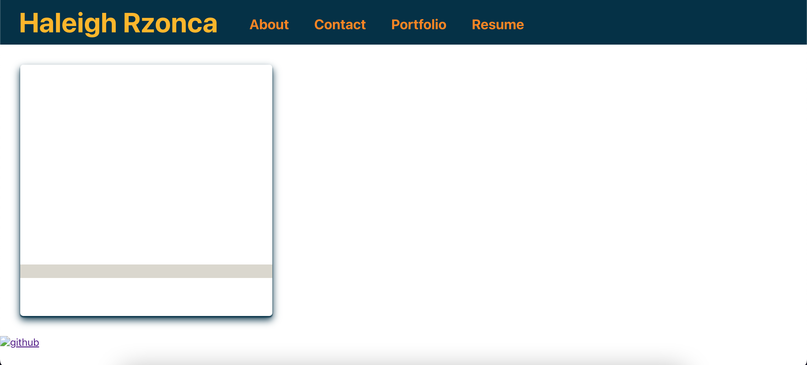
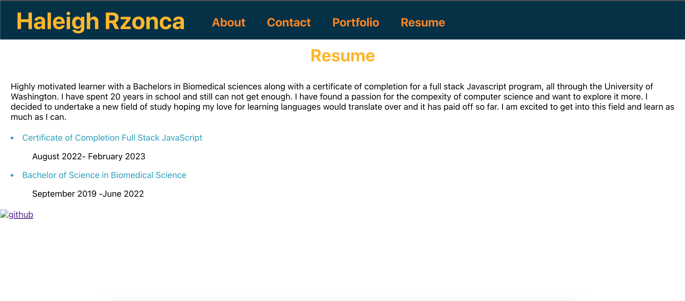

# react-portf






# Table of Contents
## Descption
## Installation
## License
## Questions

# Description
This application is a front end portfiolo for my work created with React. This allows me to share my work and information with future employers. 

Live: (https://hrzonca.github.io/react-portfolio/)

# Installation 
Clone repository to local 

run ``` npm install ```

This comand should install all needed dependencies.

# License 
MIT

# Questions 
Contact me with questions by clicking links below

Email (hgielah@gmail.com) 

Github (https://github.com/Hrzonca)

LinkedIn (https://www.linkedin.com/in/haleigh-rzonca-794942249/)